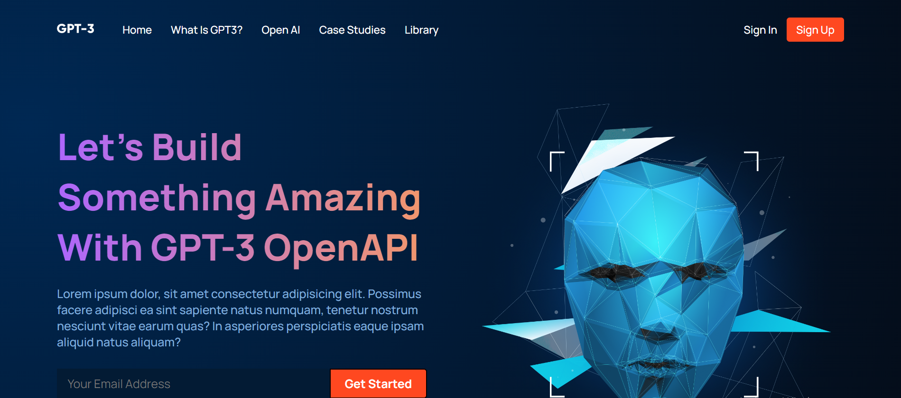

# GPT-3 Landing Page
A landing page created for a company that works with AI. My role in this project was to create the landing page exactly like the design that was given to me.

## The Challenge
Users should be able to:
- View the optimal layout for the site depending on their device's screen
- Scroll to the section they select
- See interactive hamburger menu on mobile devices

## Built with
- React.JS
- CSS Modules

## Screenshot

## Links
- Live Preview URL: https://superlative-dodol-56ea3a.netlify.app